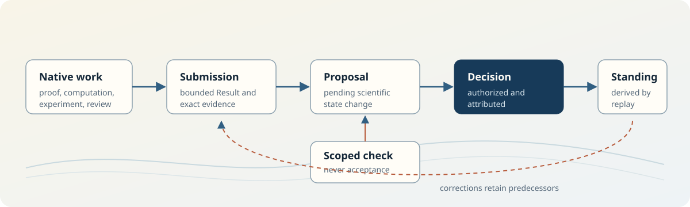

<p align="center">
  
</p>

<h1 align="center">Vela</h1>

<p align="center">
  <strong>Version control for scientific state.</strong>
</p>

<p align="center">
  <a href="https://www.vela.space">Website</a> ·
  <a href="https://problems.science">Problems</a> ·
  <a href="docs/QUICKSTART.md">Quickstart</a> ·
  <a href="docs/README.md">Docs</a> ·
  <a href="docs/PROTOCOL.md">Protocol 1</a> ·
  <a href="docs/THREAT_MODEL.md">Security</a>
</p>

---

Git remembers how code changed. Vela records how scientific state changed.

Vela lets a repository show what was claimed, what evidence supported it, what
was checked, who accepted or rejected it, what was later corrected, and what a
new researcher can safely inherit.

It is a Git-native protocol and CLI for governed, replayable scientific-state
transitions. Work stays in the tools researchers already use. Vela begins when
someone has a bounded Result to submit.

<p align="center">
  
</p>

## Try a real Repository

Install the current signed release, clone the public Math Repository, and
replay its scientific state:

```bash
curl -fsSL https://raw.githubusercontent.com/vela-science/vela/v0.977.3/install.sh | \
  VELA_VERSION=v0.977.3 bash

git clone https://github.com/vela-science/math.git math
git -C math checkout 5de716c896065c03c0a470d015ba2a328a527f73

vela status math
vela claims math
vela replay math
```

This read path needs no Vela account, daemon, hosted service, or authority key.
Use a complete clone. Exact offline reads refuse shallow, partial, alternate,
or grafted Git object stores.

At the pinned commit, strict replay reports:

- 3 current accepted Claims;
- 6 authenticated Submissions;
- 6 scoped Verification Records;
- 0 pending reviews; and
- Repository root
  `sha256:a956b84c437202e5a02cc9e036a621bd14a302b34a75758115730bdbb77c52a4`.

Read why the current Erdős 321 Claim is accepted:

```bash
vela why math \
  vcl_b9c6915de55e15c69d06b9aeed786b0e632986374a347d77ff447ad244f67a2e
```

The output binds the Claim to its Submission, scoped check, attributed
Decision, authority history, correction predecessor, and current Standing. It
also preserves the limits: this is a bounded candidate answer for one exact
Formal Conjectures occurrence, not a proof that resolves Erdős 321.

The other current examples are equally scoped. Erdős 94 records one exact
`sum_multiplicity` theorem, not the cubic distance-multiplicity conjecture.
Erdős 887 records a compiled-cache replay with four expected `sorry` warnings,
not a complete proof.

For a guided write journey, continue with the
[quickstart](docs/QUICKSTART.md).

## The problem Vela solves

Scientific work is spread across papers, repositories, proof assistants,
datasets, notebooks, agents, and review systems. Those systems preserve useful
native facts, but they do not provide one exact, portable answer to these
questions:

- What Result was actually submitted?
- Which source revision and artifacts does it depend on?
- What did each checker test, and what did the check not establish?
- Who made the scientific Decision, under which Repository authority?
- Which Claim is current after a correction?
- Can another researcher reconstruct the answer from public Git bytes?

Vela records that inheritance boundary without replacing the native systems
that produced the work.

## How scientific state changes

<p align="center">
  
</p>

```text
native work
    │
    ▼
Submission ──► pending Proposal
                    │
Verification ───────┤
                    ▼
          authorized Decision
                    │
                    ▼
             Event + Standing
                    │
                    ▼
             deterministic replay
```

The boundaries are strict:

1. Git preserves bytes and ancestry.
2. A Submission authenticates bounded producer evidence.
3. A Verification Record reports one declared check.
4. Only an authorized, attributed Decision changes Standing.
5. Replay derives current state from exact records and authority history.

A passing check is not acceptance. A Git merge is not acceptance. A signature
proves control of a key over exact bytes; it does not prove a scientific Claim
true.

## Keep your tools

Vela does not run the scientific work.

| Existing system | Keeps its job |
| --- | --- |
| Git | Bytes, commits, branches, and ancestry |
| Lean, Lake, laboratory software | Native execution and domain checks |
| Codex, Claude, and other agents | Producing and checking bounded work |
| Source repositories and registries | Source identity, scope, and status |
| Vela | Submission, Verification, Decision, correction, Standing, and replay |

Vela does not search the literature, rank Problems, allocate effort, generate
proofs, certify novelty, or host a universal scientific authority. Source
repositories remain sovereign.

## What works today

| Capability | Current state |
| --- | --- |
| Signed CLI | `v0.977.3` for Linux x86-64 and macOS Apple silicon |
| Repository format | Protocol 1 release candidate with Submission v3 |
| Read path | Status, Claims, object inspection, explanation, log, and strict replay |
| Write path | Authenticated Submission, scoped Verification, accept or reject Decision |
| Corrections | Root-bound predecessor relations with superseded history retained |
| Authority | Repository-local Ed25519 authority through the OpenSSH agent |
| Interoperability | Stable JSON output, generated schemas, and independent readers |
| Reference Repository | Public formal-math lineage with 3 accepted bounded Claims |

The release is pre-1.0. External recurrence, plural independently operated
authorities, and broad scientific adoption remain unproven. A small internal,
information-matched three-case evaluation produced a positive descriptive
signal for Vela-packaged inheritance, but it has not been externally
replicated and does not establish a general productivity advantage. Read the
[exact scores, evidence roots, and limitations](docs/EVIDENCE.md).

## Operate a Repository

The ordinary CLI is small:

```text
init status claims submit show why review replay log
```

Advanced operator surfaces are grouped separately:

```text
projection verification correction integration recover authority
```

The write loop is:

```bash
# Create a bounded Repository using one Ed25519 key already loaded in ssh-agent.
vela init ./my-repository \
  --name "Bounded question" \
  --scope "Does X hold under Y?"

# Retain one producer Result as a pending Proposal.
vela submit --repo ./my-repository \
  --claim "<bounded result>" \
  --type computational \
  --replayability exact \
  --artifact <path>:<kind> \
  --caveat "<what this does not establish>" \
  --as agent:<producer> \
  --json

# Retain a scoped check whose method is already tracked and clean.
vela verification record ./my-repository <vpr_id> \
  --profile exact-replay-v1 \
  --method verification/method.json \
  --outcome pass \
  --does-not-establish "Scientific acceptance." \
  --independent-of agent:<producer> \
  --as verifier:<reviewer> \
  --json

# Inspect the exact Decision packet, then accept or reject it.
vela review inbox ./my-repository --json
vela review show ./my-repository <vpr_id> --json
vela review accept ./my-repository <vpr_id> \
  --reason "<bounded scientific reason>" \
  --if-entry-root sha256:... \
  --as human:<reviewer> \
  --json

vela replay ./my-repository --json
vela why ./my-repository <claim_id> --json
```

`--as` attributes the performer. It does not select a key or grant authority.
The Repository authority principal and signer remain separate in the Decision
record.

See the [quickstart](docs/QUICKSTART.md) for key setup, tracked Verification
Methods, rejection, trust pins, and recovery.

## Repository and product boundaries

A Vela Repository is an ordinary Git repository and one scientific authority
boundary. Canonical state consists of typed, content-addressed records plus an
append-only authority history. Web pages, databases, graphs, search indexes,
and other projections are disposable readers.

The Vela source repository is not itself a scientific Vela Repository. Do not
run `vela init` here or add a root `.vela/` directory.

The wider ecosystem keeps separate deployment and authority boundaries:

- [Vela Core](https://github.com/vela-science/vela) defines the protocol, CLI,
  schemas, replay, and authority runtime.
- [Vela Math](https://github.com/vela-science/math) is the current public
  scientific reference Repository.
- [Vela Workbench](https://github.com/vela-science/vela-workbench) is a local
  desktop surface for repository work and explicit handoff.
- [problems.science](https://problems.science) is a read and contribution
  product. It does not become scientific authority by displaying records.
- [vela.space](https://vela.space) is the editorial home for the project and
  its long-range scientific inheritance vision.

See [Repository boundaries](docs/REPOSITORY_BOUNDARIES.md) for the exact split.

## Security

Repository authority is a service identity. Vela records the authenticated
principal, authorization decision, exact read set, semantic action, performer,
and signer. It never reads or stores private-key files.

- Producers authenticate bounded work only.
- Verifiers record scoped observations only.
- `review accept` and `review reject` are the only ordinary Decision actions.
- Vela signs through the standard OpenSSH agent.
- Preflight or signing failure creates no committed transaction.
- Consumers can pin the sequence-one authority root through an independent
  channel.

Read [Authority and attribution](docs/SIGNING.md) and the
[threat model](docs/THREAT_MODEL.md) before operating authority.

## Build and contribute

Build the current source:

```bash
git clone https://github.com/vela-science/vela.git
cd vela
cargo build --release
./target/release/vela --help
```

Ordinary changes should run focused checks. Release qualification runs the
larger deterministic union. See [CONTRIBUTING.md](CONTRIBUTING.md) for useful
contribution paths and validation commands.

## Documentation

- [Quickstart](docs/QUICKSTART.md)
- [Documentation by task](docs/README.md)
- [Current evidence and validation gates](docs/EVIDENCE.md)
- [CLI contract](docs/CLI.md)
- [Protocol 1](docs/PROTOCOL.md)
- [Architecture](docs/ARCHITECTURE.md)
- [Repository boundaries](docs/REPOSITORY_BOUNDARIES.md)
- [Authority and attribution](docs/SIGNING.md)
- [Verification Records](docs/VERIFICATION.md)
- [Threat model](docs/THREAT_MODEL.md)
- [Release and recovery guidance](docs/RELEASES.md)

## License

Code is dual-licensed under Apache-2.0 OR MIT. See [LICENSE](LICENSE),
[LICENSE-APACHE](LICENSE-APACHE), and [LICENSE-MIT](LICENSE-MIT). The Vela name
and marks are reserved; see [`assets/brand/LICENSE`](assets/brand/LICENSE).
