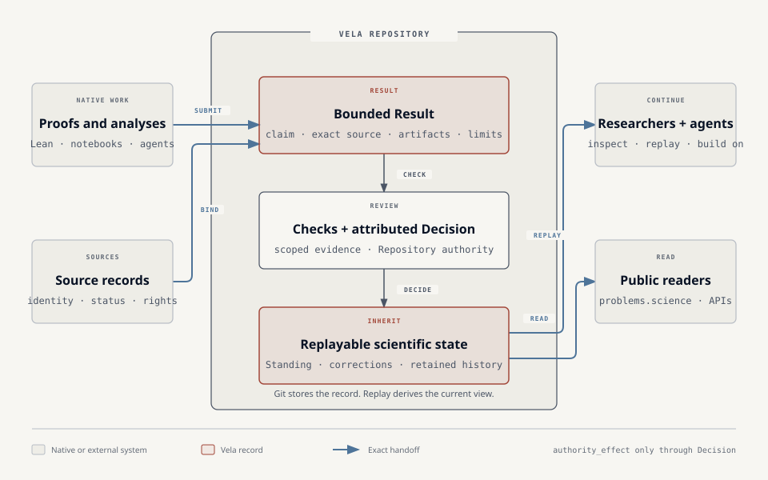

<p align="center">
  
</p>

<h1 align="center">Vela</h1>

<p align="center">
  <strong>Version control for scientific state.</strong><br>
  Scientific results that remain checkable, correctable, and useful.
</p>

<p align="center">
  <a href="https://vela.space">Vision</a> ·
  <a href="https://problems.science">Explore results</a> ·
  <a href="docs/QUICKSTART.md">Quickstart</a> ·
  <a href="docs/README.md">Documentation</a>
</p>

---

Vela is the open protocol for replayable, authority-scoped, correction-aware
scientific state transitions. The `vela` CLI implements that protocol
in ordinary Git repositories so results can survive handoffs between people,
agents, repositories, and time.

The product loop is:

```text
init -> submit -> verify -> decide -> replay
```

Each result stays connected to its exact source, evidence, scoped checks, the
authority that accepted or rejected it, and any correction. The record lives
in Git. You can replay it without trusting a Vela server.

A Vela Repository is the local authority boundary. A Frontier is only a
derived query over current Standing: it carries no authority, owns no records,
and is not a persistent governed repository.

## Where Vela fits

Native tools produce the work. Source repositories and registries retain their
own identities and status. Vela preserves the reviewed handoff into scientific
state that the next researcher—or agent—can inspect and build on.

<p align="center">
  <a href="assets/docs/vela-system-map.svg">
    
  </a>
</p>

Vela does not replace Lean, notebooks, GitHub, source registries, or scientific
judgment. It connects their outputs without turning a successful build, review,
or merge into an acceptance claim.

## See it work

Install the current signed release and inspect the public Math Repository:

```bash
curl -fsSL https://raw.githubusercontent.com/vela-science/vela/v0.977.4/install.sh | \
  VELA_VERSION=v0.977.4 bash

git clone https://github.com/vela-science/math.git math
git -C math checkout 5de716c896065c03c0a470d015ba2a328a527f73

vela status math
vela claims math
vela why math \
  vcl_b9c6915de55e15c69d06b9aeed786b0e632986374a347d77ff447ad244f67a2e
```

The status command replays the public record rather than querying a Vela
service. At the pinned commit it reports:

```text
Vela Mathematics Program
github.com/vela-science/math

  state    sha256:a956b84c437202e5a02cc9e036a621bd14a302b34a75758115730bdbb77c52a4
  replay   matched · signatures, roots, canonical bytes
  strict   pass
  claims   3
  inbox    0 pending · 0 protocol-ready · 0 protocol-blocked
```

You will read three accepted, bounded Claims and the evidence and Decision
history behind them. The Erdős 321 example is a candidate answer for one exact
Formal Conjectures occurrence. It does not prove the whole problem, and Vela
keeps that limitation attached to the result.

This read path needs no account, daemon, hosted service, or authority key.

## The idea

Researchers and agents already work in Lean, notebooks, laboratories, source
repositories, and GitHub. Those systems produce and preserve the work. Vela
records the part that the next researcher needs to inherit:

- **Result:** the exact claim, source revision, artifacts, and limitations.
- **Check:** what a reviewer or tool tested, and what it did not establish.
- **Decision:** who accepted or rejected the result under which authority.
- **Correction:** what changed, what it superseded, and what history remains.

Only an attributed Decision changes accepted state. Checks, Git merges, and
signatures each retain their narrower meaning. Researchers and agents can
build on the record without overstating what any one step established.

## What works today

- A signed Rust CLI for macOS Apple silicon and Linux x86-64.
- Git-native repositories with deterministic replay and offline inspection.
- Authenticated submissions, scoped checks, attributed accept/reject decisions,
  and correction history.
- Stable JSON and generated schemas for other tools to read.
- A public reference Repository with three accepted formal-math results.

Vela is pre-1.0. External recurrence, independently operated authorities, and
broad scientific adoption remain unproven. A small internal, information-matched
three-case evaluation found a positive descriptive signal for Vela-packaged
inheritance; it has not been externally replicated. See the
[scores, roots, and limitations](docs/EVIDENCE.md).

## Use Vela

| I want to… | Start here |
| --- | --- |
| Inspect a public Repository | [Five-minute quickstart](docs/QUICKSTART.md) |
| Submit, check, or decide a result | [Write journey](docs/QUICKSTART.md#5-submit-one-bounded-result) |
| Integrate with the CLI or JSON | [CLI contract](docs/CLI.md) |
| Understand the protocol | [Protocol 1](docs/PROTOCOL.md) |
| Operate authority safely | [Signing](docs/SIGNING.md) and [threat model](docs/THREAT_MODEL.md) |
| Find a specific document | [Documentation by task](docs/README.md) |

Before a container or fresh host starts the write loop, check only Vela's own
runtime prerequisites without creating state:

```bash
vela init ./repository --name "Bounded question" \
  --scope "Does the selected finite claim hold?" --check --json
vela verification check review-method.json \
  --profile <profile> --property "<property>" --as verifier:<name> \
  --does-not-establish "Scientific acceptance." --json
```

Vela reports missing local identity and invalid Review Method bindings. The
runner still owns container stdin, the Git working directory, bind-mount path
resolution, and generation of experiment-specific manifests.

The wider project includes:

- [problems.science](https://problems.science): browse problems and public results;
- [Vela Workbench](https://github.com/vela-science/vela-workbench): local repository work and explicit handoff;
- [Vela Math](https://github.com/vela-science/math): the public scientific reference Repository; and
- [vela.space](https://vela.space): the long-range vision for scientific inheritance.

## Build and contribute

```bash
git clone https://github.com/vela-science/vela.git
cd vela
cargo build --release
./target/release/vela --help
```

See [CONTRIBUTING.md](CONTRIBUTING.md) for useful contribution paths and
focused validation commands.

## License

Code is dual-licensed under Apache-2.0 OR MIT. See [LICENSE](LICENSE),
[LICENSE-APACHE](LICENSE-APACHE), and [LICENSE-MIT](LICENSE-MIT). The Vela name
and marks are reserved; see [`assets/brand/LICENSE`](assets/brand/LICENSE).
