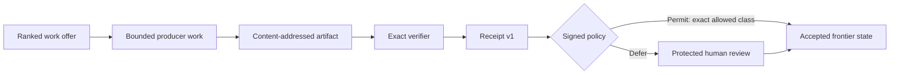

<p align="center">
  
</p>

<p align="center"><strong>Version control for scientific state.</strong></p>

<p align="center">
  Capture evidence. Reproduce it exactly. Keep verification and scientific authority distinct.
</p>

<p align="center">
  <a href="https://github.com/vela-science/vela/releases"></a>
  <a href="https://crates.io/crates/vela-cli"></a>
  <a href="https://github.com/vela-science/vela/actions"></a>
  <a href="LICENSE-APACHE"></a>
</p>

<p align="center">
  <a href="https://www.vela.space">Website</a> ·
  <a href="https://app.vela.space/frontiers">Observatory</a> ·
  <a href="docs/PROTOCOL.md">Protocol</a> ·
  <a href="docs/CLI.md">CLI</a> ·
  <a href="docs/PRODUCER_QUICKSTART.md">Producer guide</a>
</p>

Vela turns a Git repository into a **frontier**: a content-addressed, replayable
record of evidence, review, policy, and the scientific state accepted by one
named authority for one bounded scope. Other authorities can disagree or fork.
The history remains inspectable either way.

The core rule is simple: **verifier success is evidence, not acceptance**.
Agents may produce work and verifiers may check it. Accepted scientific state
changes only through an exact human decision or a narrow policy that a human
already signed.

## Quickstart

Install the checksum-verified public beta on Apple Silicon macOS or Linux
x86-64:

```sh
curl -fsSL https://raw.githubusercontent.com/vela-science/vela/v0.910.0/install.sh \
  | VELA_VERSION=v0.910.0 bash
vela --version
```

Windows x86-64:

```powershell
& ([scriptblock]::Create((Invoke-WebRequest https://raw.githubusercontent.com/vela-science/vela/v0.910.0/install.ps1).Content)) -Version v0.910.0
vela --version
```

Then reproduce the included Sidon witness set from tracked bytes:

```sh
git clone https://github.com/vela-science/vela.git
cd vela
vela reproduce examples/sidon-a309370
```

That command runs the declared exact verifiers again. A successful replay
proves that the stored artifacts still produce the recorded scoped result in a
supported environment. It does **not** prove universal truth, future artifact
availability, or scientific acceptance.

## The working loop

```sh
vela status <frontier>
vela next <frontier> --json
vela work <target> --frontier <frontier> --as agent:<you> --json

# Produce the bounded artifact and run the verifier named by the work packet.

vela land --frontier <frontier> --work <target> --claim <result> \
  --type computational --replayability exact --artifact <path>:<kind> \
  --caveat <scope-limit> --as agent:<you> --json

vela reproduce <frontier>
```

`vela land` creates a Receipt and lets the frontier's signed policy route it.
`Permit` can admit only a narrowly pre-authorized class. `Defer` leaves a
proposal pending for a registered human reviewer. A producer can withdraw its
own Receipt-bound pending proposal, but cannot accept, reject, or finalize it.

## How state moves



The website and Hub are read-only projections. Neither can sign, accept a
proposal, or become a second source of truth.

## What each layer is allowed to say

| Layer | Mechanically establishes | Does not establish |
| --- | --- | --- |
| Git and event log | Exact bytes, ancestry, signatures, deterministic replay | Scientific truth |
| Verifier | The declared check passed for the exact artifact and claim root | Independent acceptance |
| Receipt | Who produced what, under which packet, profile, caveat, and verifier | A verdict |
| Signed policy | Whether an exact pre-authorized class may enter automatically | General trust in a producer or model |
| Human decision | One registered authority accepted or rejected one exact proposal | Universal consensus |

The verification gate is derived from retained attachments; it has no mutable
status setter. A claim needs independent matched methods and a surviving
adversarial probe before Vela renders it `verified`. See
[Verification](docs/VERIFICATION.md) for the exact G1–G4 contract and reject
vectors.

## Repository map

| Path | Purpose |
| --- | --- |
| `crates/vela-protocol` | Reference reducer and protocol types |
| `crates/vela-cli` | Everyday `vela` command-line product |
| `crates/vela-verify` | Frozen exact verifier implementations |
| `crates/vela-hub` | Read-only index over strictly verified Git history |
| `clients/python` | Independent replay subset used by conformance |
| `conformance` | Cross-implementation fixtures and malicious-input vectors |
| `examples` | Replayable examples and immutable historical fixtures |
| `lean` | Machine-checked governance models and certificate checking |
| `schema` | Portable packet and finding schemas |

## Build from source

Vela requires a current stable Rust toolchain.

```sh
cargo build --release
./target/release/vela --help
python3 conformance/verify.py
```

Install the CLI from crates.io with an exact version:

```sh
cargo install --locked vela-cli --version 0.910.0
```

Linux protected signing additionally requires the packaged polkit action. See
[Review and authority](docs/CLI.md#review-and-authority) before enabling a human
identity. Agents do not need, and must never receive, a human signing key.

## Documentation

- [Protocol](docs/PROTOCOL.md) — normative objects, events, replay, and standing
- [CLI](docs/CLI.md) — complete command reference
- [Producer quickstart](docs/PRODUCER_QUICKSTART.md) — contribute without a human key
- [Receipts](docs/RECEIPTS.md) — portable producer provenance
- [Verification](docs/VERIFICATION.md) — exact gate semantics
- [Roots and identifiers](docs/ROOTS.md) — content-addressing contract
- [Threat model](docs/THREAT_MODEL.md) — trust boundaries and failure modes
- [Governance](docs/GOVERNANCE.md) — stewardship and protected decisions

## License

Code is dual-licensed under Apache-2.0 OR MIT, at your option. The Vela name and
marks are trademark rights reserved; see [`assets/brand/LICENSE`](assets/brand/LICENSE).
